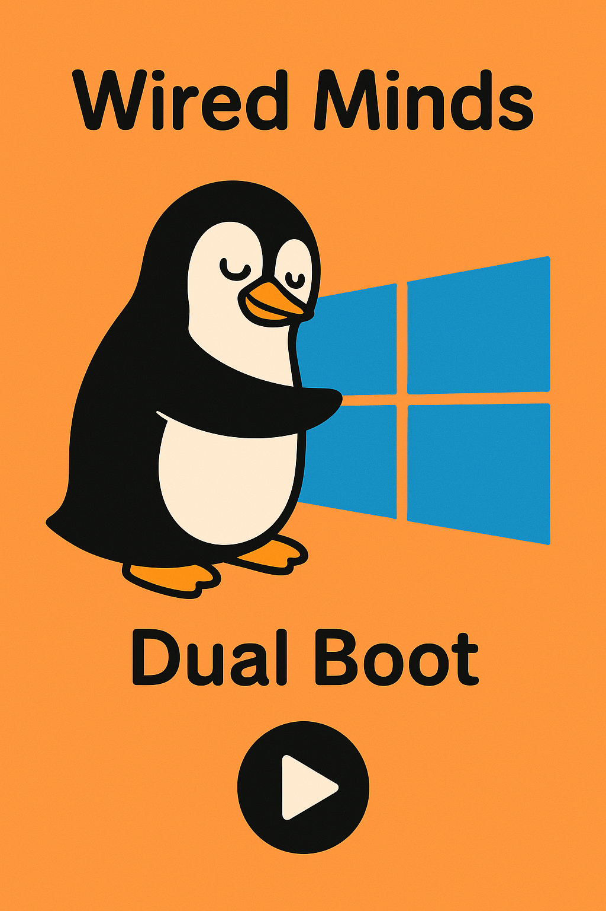

# SNHU Wired Minds - Robotics Cohort

  

    <h2 style="display:inline; font-size:1.2em; margin-left:0.25em;">🧭 Dual-Boot Windows + Ubuntu (Step-by-Step)</h2>

### What you need

- A USB drive ≥ 8 GB
- A Windows 10/11 PC already working
- An Ubuntu ISO (e.g., Ubuntu Desktop LTS)

> **Safety**: Back up important files. Shrinking partitions is safe when done right, but mistakes happen.

### Download Ubuntu ISO

Go to ubuntu.com → Download → Ubuntu Desktop and get the .iso.

### Create the USB installer (Rufus)

- Download Rufus (Windows x64) from the official site.
- Insert your USB drive.

#### Open Rufus:

- Device: your USB stick (double-check).
- Boot selection: Disk or ISO image → SELECT → pick the Ubuntu ISO.
- Leave the defaults Rufus suggests (usually GPT / UEFI).
- Click START → accept prompts → wait until it finishes.

Critical: Selecting the wrong “Device” will wipe that drive. Verify!

### Make space for Ubuntu (shrink Windows partition)

- Press Win+X → Disk Management.
- Right-click C: (Windows) → Shrink Volume…
- Enter how much to shrink:
  - Minimum workable: 25 GB.
  - For dev/ROS work: 80–150 GB (or go ~half and half if you have plenty of space).
- Click Shrink. You should see Unallocated space (black bar).

### (Often helps) Check Secure Boot

- In Windows, open System Information → Secure Boot State.

If On: Hold Shift and click Restart → Troubleshoot → Advanced options → UEFI Firmware Settings → enter BIOS/UEFI.

- Find Secure Boot and Disable it. Save & Exit.

Note: Many PCs can install Ubuntu with Secure Boot on, but it causes issues for some drivers. If you prefer, leave it on and only disable if you hit problems.

### Boot from the Ubuntu USB

- Plug in the Ubuntu USB (if not already).
- In Windows: Shift + Restart → Use a device → choose your USB (it’ll mention the brand/“Ubuntu”).
- In the boot menu, choose Try or Install Ubuntu (or directly Install Ubuntu).

### Install Ubuntu “alongside Windows”

- Pick language/keyboard; connect Wi-Fi if you want updates during install.
- When asked about install type, select “Install Ubuntu alongside Windows Boot Manager.”

If you instead see “Something else”, you can manually select the Unallocated space and create:
    - / (root) ext4 partition (most of the space)

- optional swap (2–8 GB if you want hibernate; otherwise skip on modern systems)
- Continue with the user info prompts and start the install.

When finished, Restart and remove the USB when prompted.

### Pick OS at startup (GRUB)

After reboot you should see the Ubuntu boot menu (GRUB):
- Top entry: Ubuntu
- Entry near the bottom: Windows Boot Manager (to boot Windows)

If you booted straight to Windows:

- Enter BIOS/UEFI again (Shift+Restart → UEFI Firmware Settings or F2/Del at power-on).
- Find Boot Order / Boot Priority.
- Move Ubuntu (or the drive entry that says “ubuntu/GRUB”) above Windows Boot Manager.
- Save & Exit.

### First steps in Ubuntu

- Open Activities and search Terminal; pin it to the sidebar.

Optional quick setup:

- Software Updater (or sudo apt update && sudo apt upgrade -y)
- Install common tools when ready (e.g., build-essentials, Git, Python, etc.).
- Troubleshooting quick hits

#### Rufus not booting? Recreate USB; ensure UEFI/GPT matches your system. Try a different USB port.

#### No “Install alongside Windows”? Ensure you shrank C: in Windows first so there’s Unallocated space.

#### Windows BitLocker/Intel RST: If C: is BitLocker-encrypted or Intel RST is on, you may need to suspend BitLocker or switch storage mode from RST to AHCI (research your model first).

#### Can’t see GRUB after install: Set Ubuntu/“ubuntu” as first in Boot Order. Sometimes you must disable Fast Boot in BIOS and Fast Startup in Windows.

#### Want to change default OS later? In Ubuntu: sudo nano /etc/default/grub (set GRUB_DEFAULT), then sudo update-grub.

