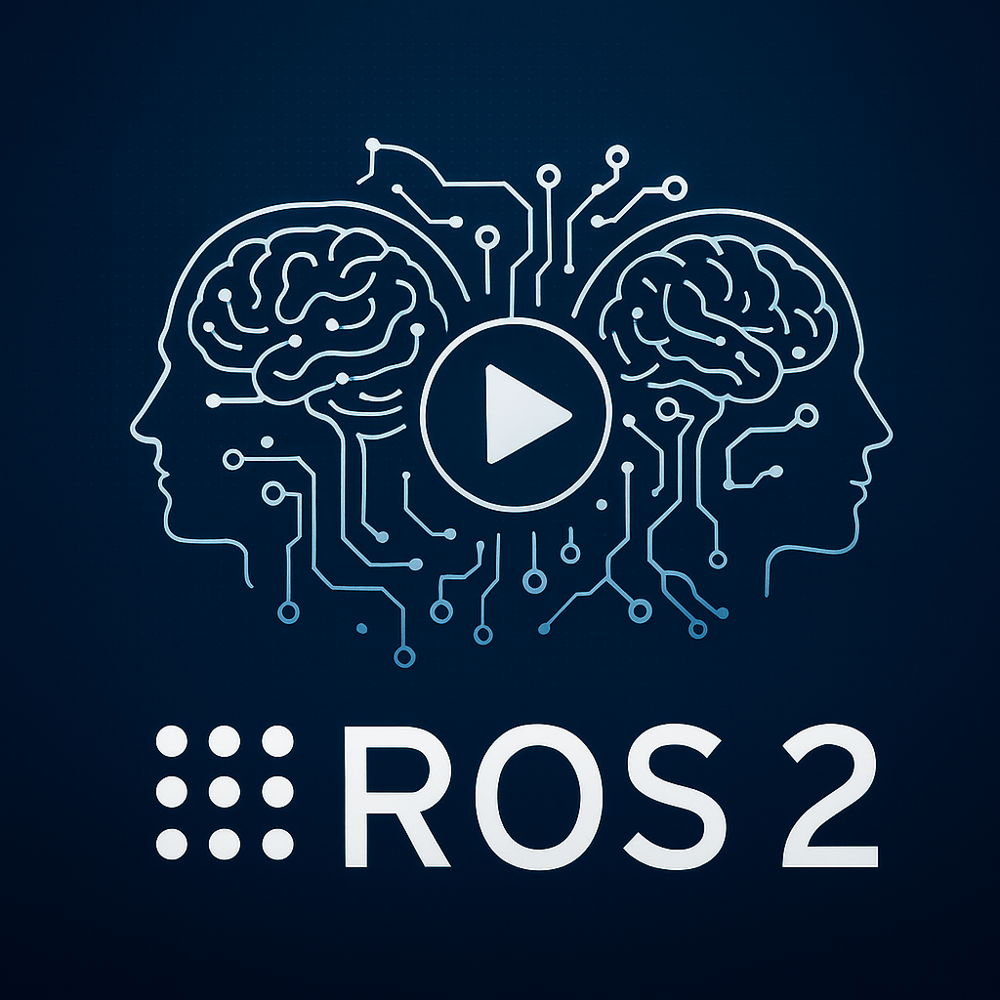

# SNHU Wired Minds - Robotics Cohort
<link rel="stylesheet" href="details.css">

<p align="center">
  <a href="https://youtu.be/MPAcc8LaE6M" target="_blank">
    
  </a>
</p>

<details>

## 🧭 Dual-Boot Windows + Ubuntu (Step-by-Step)

<div markdown="1">

---

### What you need

- A USB drive ≥ 8 GB
- A Windows 10/11 PC already working
- An Ubuntu ISO (e.g., Ubuntu Desktop LTS)

> **Safety**: Back up important files. Shrinking partitions is safe when done right, but mistakes happen.

### Download Ubuntu ISO

Go to ubuntu.com → Download → Ubuntu Desktop and get the .iso.

### Create the USB installer (Rufus)

- Download Rufus (Windows x64) from the official site.
- Insert your USB drive.

#### Open Rufus:

- Device: your USB stick (double-check).
- Boot selection: Disk or ISO image → SELECT → pick the Ubuntu ISO.
- Leave the defaults Rufus suggests (usually GPT / UEFI).
- Click START → accept prompts → wait until it finishes.

Critical: Selecting the wrong “Device” will wipe that drive. Verify!

### Make space for Ubuntu (shrink Windows partition)

- Press Win+X → Disk Management.
- Right-click C: (Windows) → Shrink Volume…
- Enter how much to shrink:
  - Minimum workable: 25 GB.
  - For dev/ROS work: 80–150 GB (or go ~half and half if you have plenty of space).
- Click Shrink. You should see Unallocated space (black bar).

### (Often helps) Check Secure Boot

- In Windows, open System Information → Secure Boot State.

If On: Hold Shift and click Restart → Troubleshoot → Advanced options → UEFI Firmware Settings → enter BIOS/UEFI.

- Find Secure Boot and Disable it. Save & Exit.

Note: Many PCs can install Ubuntu with Secure Boot on, but it causes issues for some drivers. If you prefer, leave it on and only disable if you hit problems.

### Boot from the Ubuntu USB

- Plug in the Ubuntu USB (if not already).
- In Windows: Shift + Restart → Use a device → choose your USB (it’ll mention the brand/“Ubuntu”).
- In the boot menu, choose Try or Install Ubuntu (or directly Install Ubuntu).

### Install Ubuntu “alongside Windows”

- Pick language/keyboard; connect Wi-Fi if you want updates during install.
- When asked about install type, select “Install Ubuntu alongside Windows Boot Manager.”

If you instead see “Something else”, you can manually select the Unallocated space and create:
    - / (root) ext4 partition (most of the space)

- optional swap (2–8 GB if you want hibernate; otherwise skip on modern systems)
- Continue with the user info prompts and start the install.

When finished, Restart and remove the USB when prompted.

### Pick OS at startup (GRUB)

After reboot you should see the Ubuntu boot menu (GRUB):
- Top entry: Ubuntu
- Entry near the bottom: Windows Boot Manager (to boot Windows)

If you booted straight to Windows:

- Enter BIOS/UEFI again (Shift+Restart → UEFI Firmware Settings or F2/Del at power-on).
- Find Boot Order / Boot Priority.
- Move Ubuntu (or the drive entry that says “ubuntu/GRUB”) above Windows Boot Manager.
- Save & Exit.

### First steps in Ubuntu

- Open Activities and search Terminal; pin it to the sidebar.

Optional quick setup:

- Software Updater (or sudo apt update && sudo apt upgrade -y)
- Install common tools when ready (e.g., build-essentials, Git, Python, etc.).
- Troubleshooting quick hits

#### Rufus not booting? Recreate USB; ensure UEFI/GPT matches your system. Try a different USB port.

#### No “Install alongside Windows”? Ensure you shrank C: in Windows first so there’s Unallocated space.

#### Windows BitLocker/Intel RST: If C: is BitLocker-encrypted or Intel RST is on, you may need to suspend BitLocker or switch storage mode from RST to AHCI (research your model first).

#### Can’t see GRUB after install: Set Ubuntu/“ubuntu” as first in Boot Order. Sometimes you must disable Fast Boot in BIOS and Fast Startup in Windows.

#### Want to change default OS later? In Ubuntu: sudo nano /etc/default/grub (set GRUB_DEFAULT), then sudo update-grub.

</div>
</details>

<p align="center">
  <a href="https://youtu.be/V58CuRmzmbc" target="_blank">
    
  </a>
</p>

<details>

## 🧭 Dual-Boot Windows + Ubuntu (Step-by-Step)

  <div markdown="1">
    ROS 2 “Jazzy Jalisco” Installation on Ubuntu 24.04 (Step-by-Step Guide)

What you need:
- Ubuntu 24.04 LTS (64-bit) – A desktop installation (Ubuntu “Noble”) with internet access.
- Admin access (sudo) on the Ubuntu system.
- Basic terminal knowledge – You will be entering commands in the Terminal.

ROS 2 Jazzy Jalisco is the latest long-term support (LTS) version of ROS 2, designed to run on Ubuntu 24.04 LTS
gazebosim.org. This guide will walk you through installing ROS 2 (desktop edition) along with Rviz and Gazebo simulator, following the steps demonstrated in the video. We’ll also verify the installation using example ROS 2 talker/listener nodes and a Gazebo test world.

1. Set the Locale to UTF-8 (US English)

ROS 2 requires the system locale to be UTF-8. We’ll ensure your Ubuntu is using en_US.UTF-8:
- Open a terminal (Ctrl+Alt+T in Ubuntu).
- Check current locale:

```bash
locale
```

Look for lines containing “UTF-8”. If you see en_US.UTF-8 for LANG or LC_ALL, your locale is already set. If not, proceed to generate the locale.

- Generate and set UTF-8 locale: Run the following commands one by one:
```bash
sudo apt update && sudo apt install locales -y
sudo locale-gen en_US en_US.UTF-8
sudo update-locale LC_ALL=en_US.UTF-8 LANG=en_US.UTF-8
export LANG=en_US.UTF-8
```

  - The first command updates Ubuntu’s package list and ensures the locales package is installed automaticaddison.com.
  - The locale-gen and update-locale commands generate and set the system locale to US English UTF-8 automaticaddison.com.
  - The export LANG... command applies the locale setting in the current terminal session (so you don’t have to restart the terminal) automaticaddison.com.

- Verify the locale: Run locale again. You should now see LANG=en_US.UTF-8 (and LC_ALL=en_US.UTF-8). This confirms your system is configured to use UTF-8 encoding. If the output looks correct, continue to the next step.

2. Enable ROS 2 Package Sources (apt Repository)

Next, add the official ROS 2 apt repository to Ubuntu. This will allow us to install ROS 2 packages via Ubuntu’s package manager:

- Install support for apt repositories:
```bash
sudo apt install software-properties-common -y
sudo add-apt-repository universe
```

  - The software-properties-common package provides tools to manage software sources on Ubuntu automaticaddison.com.
  - Enabling the “universe” repository gives access to community-maintained packages required by ROS 2 automaticaddison.com. Press Enter or “Y” if prompted to confirm adding the repository.

- Add the ROS 2 GPG key (to authenticate downloads):
```bash
sudo apt update && sudo apt install curl -y
sudo curl -sSL https://raw.githubusercontent.com/ros/rosdistro/master/ros.key -o /usr/share/keyrings/ros-archive-keyring.gpg
```
The first command ensures you have curl installed (a tool to download files) automaticaddison.com. The second command fetches the official ROS 2 key and saves it to your keyrings. This key is used by apt to verify ROS 2 packages (ensuring they’re from a trusted source automaticaddison.com).

- Add the ROS 2 apt repository to your system’s sources list:
```bash
echo "deb [arch=$(dpkg --print-architecture) signed-by=/usr/share/keyrings/ros-archive-keyring.gpg] \
http://packages.ros.org/ros2/ubuntu $(lsb_release -cs) main" | sudo tee /etc/apt/sources.list.d/ros2.list > /dev/null
```

This command adds ROS 2’s package server to your system. It uses your Ubuntu codename (e.g., “noble” for 24.04) and the ROS key we added to ensure packages are trusted automaticaddison.com.

- Update package index:
```bash
sudo apt update
```

After adding new sources, always run apt update to refresh the package list. You should see the ROS 2 repository being fetched in the output (lines mentioning packages.ros.org/ros2/...).

3. Install ROS 2 (Desktop) and Development Tools

Now we’ll install the ROS 2 Jazzy Desktop package (which includes ROS 2 core, Rviz2 visualization tool, demos, and more) automaticaddison.com. We’ll also install some developer tools that help in building and managing ROS packages:

- Install ROS development tools (compilers, colcon build tool, etc.):
```bash
sudo apt install ros-dev-tools -y
```
This meta-package includes compilers and other essential tools to build ROS packages reddit.com. (It’s recommended to install this before building or using ROS workspaces.)

- Upgrade system packages (optional but recommended):
```bash
sudo apt upgrade -y
```
This will update any outdated packages on your system to the latest versions. It’s good practice to run after adding new sources, so your system is fully up-to-date. If prompted to confirm, press “Y” and Enter.

- Install ROS 2 Jazzy (desktop edition):
```bash
sudo apt install ros-jazzy-desktop -y
```

This will download and install the ROS 2 Jazzy Jalisco distribution (desktop bundle). It includes the ROS 2 core libraries, RViz 2 (the 3D visualization tool), command-line tools, and some example/demos automaticaddison.com. When prompted, type “Y” and press Enter to confirm installation.

    💡 Note: The desktop package includes GUI tools like Rviz and demos. If you were installing ROS on a headless robot (no GUI), you could use ros-      jazzy-ros-base (ROS core without GUI tools) to save space. For development on a laptop/PC, ros-jazzy-desktop is recommended.

This installation may take a few minutes, as it downloads many packages. Once it completes, ROS 2 is installed on your system.

4. Set Up ROS Environment Variables (Automatically on Shell Startup)

After installation, you need to configure your shell environment so that ROS 2 commands and packages are recognized. This is done by “sourcing” ROS setup scripts. Instead of doing this manually every time, we’ll add it to your shell startup file:

- Source ROS 2 in your bash startup:
```bash
echo "source /opt/ros/jazzy/setup.bash" >> ~/.bashrc
```

This appends a line to your ~/.bashrc file to source the ROS 2 setup script for Jazzy automaticaddison.com. From now on, every new terminal will automatically load the ROS 2 environment (setting up PATH, environment variables, etc., for ROS 2).

- Apply the change:
```bash
source ~/.bashrc
```
  Run this command in the current terminal to load the changes immediately (otherwise, the new setting will take effect in any new terminal you open).

Now your shell knows about ROS 2. You won’t need to manually source ROS scripts each time.

5. Verify the ROS 2 Installation

Let’s run a simple “talker/listener” demo to ensure ROS 2 is working correctly. ROS uses nodes that communicate via topics; we’ll start a talker node (publishing messages) and a listener node (subscribing to those messages):

- Open a new terminal (it will have ROS sourced automatically from the previous step) and run the Talker example:
```bash
ros2 run demo_nodes_cpp talker
```
  This starts a C++ talker node that publishes “Hello World” messages with an incrementing count. You should see output like:
```bash
[INFO] [talker]: Publishing: 'Hello World: 1'
[INFO] [talker]: Publishing: 'Hello World: 2'
... 
```

- Open another terminal and run the Listener example:
```bash
ros2 run demo_nodes_py listener
```
  This starts a Python listener node that subscribes to the talker’s messages. In this terminal, you should start seeing lines like:
```bash
[INFO] [listener]: I heard: "Hello World: 1"
[INFO] [listener]: I heard: "Hello World: 2"
...
```
  The listener is printing the messages it receives from the talker, confirming that ROS 2 nodes can communicate. (If you don’t see any output, re-      check that both terminals have ROS sourced. Since we added to ~/.bashrc, opening a new terminal ensures the environment is set. You can also run      source ~/.bashrc in the new terminal if needed.)

- Stop the demos: Press CTRL+C in each terminal to stop the talker and listener nodes.

✅ If both talker and listener ran and you see messages being passed, your ROS 2 installation is successful! automaticaddison.com automaticaddison.com

- Test RViz 2 (ROS visualization tool): In a terminal, run:
```bash
ros2 run rviz2 rviz2
```
  This should open the RViz2 application, an empty visualization window. (It may take a few seconds the first time.) RViz lets you visualize robots,     sensor data, and more in 3D. For now, just verify that it launches. You can close the RViz window after. (We’ll use RViz when we start working        with robot simulations or real robot data.)

6. Install Gazebo Simulator (for ROS 2 Jazzy)

Gazebo is a 3D physics simulator that we’ll use to simulate robots in a virtual environment. The ROS 2 Jazzy release is paired with Gazebo Harmonic (LTS) as the recommended simulator gazebosim.org gazebosim.org. We can install the Gazebo packages that integrate with ROS 2:

- Install Gazebo (ROS Gazebo integration):
```bash
sudo apt install ros-jazzy-ros-gz -y
```
  This installs Gazebo (Harmonic) and the necessary ROS–Gazebo integration packages for ROS 2 Jazzy gazebosim.org. (In ROS 2, the ros-gz packages       provide the interface between ROS and the Gazebo simulator.)
    If prompted to confirm installation, press “Y” and Enter. After installation, you have the gz simulator command available on your system.

- Note: The above command ensures you get the default Gazebo version compatible with ROS 2 Jazzy from the ROS packages repository (currently Gazebo Harmonic) gazebosim.org. There’s no need to install Gazebo separately – this meta-package pulls in the correct Gazebo release and dependencies.

7. Test the Gazebo Simulation

Finally, let’s verify that Gazebo runs and is integrated with ROS 2:

- Launch Gazebo with an example world:
  In a terminal, run:
```bash
gz sim shapes.sdf
```
  This will start the Gazebo simulator and load a simple demo world containing various shapes. You should see a new window open with a 3D simulation     environment (a ground plane and some colored shapes like boxes and spheres).

  If the command gz is not found, try opening a new terminal to ensure your environment is updated, then re-run the command. In some cases you might     need to log out and log back in for the gz command to be recognized, but adding the source to ~/.bashrc (Step 4) should handle this after a new       shell is opened.

- Interact with Gazebo: You can use your mouse in the Gazebo window to orbit the camera view (right-drag) or zoom (scroll wheel). Gazebo simulates physics, so you can press the play button (if not already running) to see gravity take effect on the shapes.

- Close Gazebo: Click the X on the Gazebo window or press CTRL+C in the terminal where Gazebo is running to shut down the simulator.

If Gazebo launched and showed the demo world, congratulations – your simulator is working! 🎉 For further testing, you can also try an empty world:
```bash
gz sim empty.sdf
```

This should show just a blank ground plane and sky. You can insert models from Gazebo’s menus or explore other demo worlds.
  </div>
</details>
